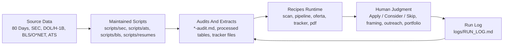

# The Reallocation Engine

**Author:** Nik Bear Brown  
**Publisher:** Bear Brown, LLC  
**Edition:** 2026

## Overview

*The Reallocation Engine* is both a book and a working repository for a verified, AI-assisted job-search system. Its central claim is that AI has made execution cheap while leaving judgment scarce. The engine therefore automates the parts of an international-student job search that can be grounded in records, scripts, and audits, while preserving the human decisions that cannot be delegated: whether a role is worth a day of effort, whether a claim is warranted by evidence, whether an output is honest, and whether the system is still serving the student's real constraint.

The book starts with the fluency trap: polished output can look like competence while hiding missing judgment. It then reframes the job search as a resource-allocation problem. The practical goal is not to apply to more jobs; it is to reallocate time away from low-yield cold applications and toward roles, companies, and channels where the evidence says effort can matter.

The repository implements that thesis through a verified-data architecture:

- source data lives in `data/`;
- maintained automation lives in `scripts/`;
- student-facing operating recipes live in `recipes/`;
- generated audits sit beside the data they inspect;
- private job-search state stays in `data/ats/` and must be reviewed before commit;
- every recipe is expected to run scripts, read audits, label judgments, and log what happened.

The engine's operating rule is simple: **run the script and read the audit before you prompt; never invent a count, rate, match quality, confidence, or coverage number.**

## Architecture At A Glance



The architecture has four separable layers.

### 1. Book Layer

`chapters/` contains the manuscript. The chapters teach the conceptual and operational architecture in sequence:

- Chapters 1-3 define the core method: fluency is not correctness, effort must be reallocated by expected return, and factual claims must obey the verified-data contract.
- Chapters 4-5 explain how recipes are written for two customers and how verified records still need epistemic interrogation.
- Chapters 6-13 build the domain components: funding, sponsorship, liveness, role quality, visa timing, composite scoring, OPT framing, and ATS-safe resumes.
- Chapters 14-16 operate and integrate the engine: run recipes, maintain the tracker, monitor skip rate, and conduct the first honest run.
- Chapter 97 synthesizes the load-bearing themes.

Planning and architecture files such as `outline.md`, `TIKTOC.md`, `CHAPTER-RESEARCH-MAP.md`, `architecture.md`, and `RESTRUCTURE-PLAN.md` record the editorial and system-design scaffolding around the manuscript.

For the full repository map, see [`docs/repo-structure.md`](docs/repo-structure.md).
For the human-readable recipe map, see [`docs/recipes.md`](docs/recipes.md).
For the full documentation index, see [`docs/README.md`](docs/README.md).

### 2. Data Layer

`DATA_CONTRACT.md` defines the repository's data boundaries.

Source/reference data:

- `data/80-days-to-stay/` — upstream 80 Days to Stay sponsorship and company material.
- `data/bls/` — BLS/O*NET/OEWS source and compact role-quality data.
- `data/sec/form-d/raw/` and `data/sec/form-d/extracted/` — downloaded and extracted SEC Form D source data.

Generated/private working data:

- `data/sec/form-d/processed/` — processed Form D JSON and audits.
- `data/ats/` — ATS scanner inputs/outputs, job pipeline files, application tracker, scan history, and pattern reports.
- `*-audit.md` — audit reports written next to the data they inspect.

`data/ats/` can reveal user-specific job-search activity. Treat it as private unless explicitly reviewed.

### 3. Script Layer

`scripts/` is the canonical maintained automation layer. New durable automation belongs here, not as one-off scripts buried in `data/`.

Major subsystems:

- `scripts/sec/` — SEC Form D download, refresh, combine, filter, entity resolution, domain inference, and validation.
- `scripts/ats/` — ATS detection, provider scanning, liveness checks, pipeline verification, tracker merge/dedup/normalization, and pattern analysis.
- `scripts/bls/` — SOC/O*NET/OEWS compact extracts and role-quality source preparation.
- `scripts/resumes/` — Markdown CV to ATS-safe PDF generation.

`scripts/` is lowercase by convention. Do not create or reference an uppercase `SCRIPTS/` directory.

Current `npm` command surface:

```bash
npm run ats:scan
npm run ats:liveness -- https://example.com/job/123
npm run ats:verify
npm run ats:merge
npm run ats:dedup
npm run ats:normalize
npm run resumes:pdf -- --all
npm run svg-to-png
```

Current Python command surface includes:

```bash
python3 scripts/audit_sec_dol_h1b_data.py
python3 scripts/sec/download_form_d_quarters.py --quarters 2025Q2 2025Q3 2025Q4 2026Q1 --user "Name email@example.com"
python3 scripts/sec/refresh_recent_sec_quarters.py
python3 scripts/sec/validate_h1b_join_sample.py
python3 scripts/bls/extract_soc_occupation_table.py
python3 scripts/ats/analyze_patterns.py
```

### 4. Recipes Layer

`recipes/` is the runtime recipe layer. A recipe is an agentic recipe: a named operation that declares what scripts it calls, what data it reads, what outputs it writes, and what must be logged.

The recipes are not the engine by themselves. They are the student-facing operating surface over the data and script layers.

Active recipes:

| Recipe | Role |
|---|---|
| `recipes/_shared.md` | Shared verified-data contract and logging rules. |
| `recipes/scan.md` | Detect ATS systems and scan portals using `scripts/ats/`. |
| `recipes/pipeline.md` | Process `data/ats/pipeline.md` through verified liveness/scoring steps. |
| `recipes/oferta.md` | Evaluate one role using sponsorship, ATS, BLS/SOC, CV, and timeline evidence. |
| `recipes/tracker.md` | Maintain and inspect `data/ats/applications.md`. |
| `recipes/pdf.md` | Generate ATS-safe PDFs from Markdown CVs using `scripts/resumes/`. |
| `recipes/patterns.md` | Analyze outcome patterns once enough tracker history exists. |
| `recipes/update.md` | Repo-local update and recipe-maintenance checklist. |

Draft/helper recipes include `apply.md`, `auto-pipeline.md`, `batch.md`, `contacto.md`, `deep.md`, `followup.md`, `interview-prep.md`, `latex.md`, `ofertas.md`, `project.md`, and `training.md`. Treat draft outputs as model judgment until a specific run proves the recipe called real scripts, read real audits, and logged the result.

Every recipe should follow the loop from Chapter 14:

1. **Run** the recipe against a real target.
2. **Inspect** the output and its provenance.
3. **Record** the run in `logs/RUN_LOG.md`.

## Component Architecture

The engine combines five operational components.

### Component 1: SEC / Funding Evidence

Chapters 3 and 6 establish the funding-data pathway. SEC Form D filings are downloaded, extracted, filtered, collapsed to company-level records, and audited. The purpose is not to produce a vague "well-funded company" impression; it is to produce checkable evidence about company financing and recency.

Relevant paths:

- `scripts/sec/`
- `data/sec/form-d/`
- `data/80-days-to-stay/data/SEC_DOL_H1b_data_mapped.csv`
- `data/80-days-to-stay/data/*-audit.md`

### Component 2: Sponsorship Scoring

Chapter 7 builds the sponsorship scorer around public DOL/H-1B evidence and company-level sponsorship tiers. Sponsorship is the most binding constraint for many international students, so it receives the highest weight in the composite scorer.

Core idea: a perfect-fit role at a non-sponsor is not a strong opportunity. It is a skip.

### Component 3: ATS Detection And Liveness

Chapter 8 treats job postings like a liveness problem. A job URL is not enough; the system looks for ATS provider, posting state, redirects, stale listings, and provider-specific signals.

Relevant paths:

- `scripts/ats/`
- `scripts/ats/providers/`
- `data/ats/portals.example.yml`
- `data/ats/scan-history.tsv`
- `data/ats/pipeline.md`

### Component 4: Role Quality / BLS / O*NET

Chapter 9 maps roles onto SOC/O*NET/BLS signals: wage level, demand, occupational family, job-zone features, and recipe/ability structure. This component helps distinguish "can I apply?" from "is this role worth targeting?"

Relevant paths:

- `scripts/bls/`
- `data/bls/`
- `data/bls/compact/soc_occupation_compact.csv`

### Component 5: Application Pipeline And Tracker

Chapters 11 and 15 combine the evidence into decisions and learning loops. The composite scorer uses four factors:

- sponsorship;
- role/CV fit;
- posting liveness;
- visa timeline.

Liveness and timeline are gates/multipliers, not ordinary votes. A role that is dead or impossible under the student's timeline should not be rescued by a high fit score.

The tracker records Apply / Consider / Skip decisions. A healthy engine should skip at least half of evaluated roles; a low skip rate usually means the filter has collapsed back into spray-and-pray.

Relevant paths:

- `recipes/oferta.md`
- `recipes/tracker.md`
- `data/ats/applications.md`
- `scripts/ats/analyze_patterns.py`

## Chapter Map

| # | Chapter | Function in the architecture |
|---|---|---|
| 00 | [Introduction](chapters/00-introduction.md) | Frames execution vs. judgment. |
| 01 | [The Fluency Trap](chapters/01-the-fluency-trap.md) | Explains why polished AI output is not proof of correctness. |
| 02 | [The Reallocation Principle](chapters/02-the-reallocation-principle.md) | Reframes job search as expected-return allocation. |
| 03 | [The Verified-Data Contract](chapters/03-the-verified-data-contract.md) | Establishes the rule: records and audits before prompts. |
| 04 | [Two Customers](chapters/04-two-customers.md) | Defines recipes as two artifacts: AI recipe and human maintenance card. |
| 05 | [Verifying the Data](chapters/05-verifying-the-data.md) | Interrogates coverage, base rates, calibration, and warranted verbs. |
| 06 | [Where the Money Went](chapters/06-where-the-money-went-sec-form-d.md) | Builds the SEC Form D funding evidence pathway. |
| 07 | [Who Sponsors](chapters/07-who-sponsors-the-80-days-sponsorship-scorer.md) | Builds sponsorship evidence and tiers. |
| 08 | [Is the Job Real](chapters/08-is-the-job-real-ats-detection-and-liveness.md) | Builds ATS detection and posting liveness checks. |
| 09 | [Is the Role Any Good](chapters/09-is-the-role-any-good-bls-onet-role-quality.md) | Uses BLS/O*NET/SOC data for role-quality judgment. |
| 10 | [The Visa Timeline Manager](chapters/10-the-visa-timeline-manager.md) | Converts OPT/STEM/H-1B timing into gates. |
| 11 | [The Bayesian Role Scorer](chapters/11-the-bayesian-role-scorer.md) | Combines sponsorship, fit, liveness, and timeline. |
| 12 | [The OPT Framing Generator](chapters/12-the-opt-framing-generator.md) | Produces honest, tier-calibrated OPT framing. |
| 13 | [Resumes That Survive the Filter](chapters/13-resumes-that-survive-the-filter.md) | Generates parser-safe resumes and validates extraction. |
| 14 | [Recipes: Operating the Engine](chapters/14-recipes-operating-the-engine.md) | Teaches run-inspect-record operation of `recipes/`. |
| 15 | [The Pipeline Tracker and the Skip Rate](chapters/15-the-pipeline-tracker-and-the-skip-rate.md) | Makes skip a first-class logged decision. |
| 16 | [The Build and the Honest Run](chapters/16-the-build-and-the-honest-run.md) | Integrates the system through phase-gated build and verification. |
| 97 | [Fundamental Themes](chapters/97-fundamental-themes.md) | Synthesizes the book's recurring architecture. |
| 98 | [Appendix: Best Practices](chapters/98-appendix-best-practices.md) | Collects repo, data, script, recipe, phase-gate, and logging rules. |

## Operating Principles

- **Fluency is not correctness.** A clean output is only a surface.
- **Execution and judgment are different jobs.** The engine automates execution so the reader can spend attention on judgment.
- **Data claims must trace to records.** If a number could be counted, it must come from a script, dataset, or audit.
- **Model judgments must be labeled.** Fit, framing, and interpretation can use AI, but they cannot masquerade as facts.
- **Gates are not votes.** Liveness and timeline can zero out an otherwise attractive role.
- **Skip is a successful action.** A high skip rate means the filter is doing work.
- **Auditability is the safety mechanism.** Every important output needs provenance.
- **Honesty is non-negotiable.** No invented credentials, no shaded work authorization status, no fake metrics.

## Typical Workflow

1. Configure or inspect ATS targets in `data/ats/`.
2. Run `recipes/scan.md` / `npm run ats:scan` to identify ATS providers and current postings.
3. Run `recipes/pipeline.md` and `npm run ats:verify` to check liveness and pipeline integrity.
4. Run `recipes/oferta.md` for a specific role: sponsorship + fit + liveness + timeline.
5. Log Apply / Consider / Skip using `recipes/tracker.md`.
6. Run `python3 scripts/ats/analyze_patterns.py` once there is enough tracker history.
7. Record significant runs, blockers, and artifacts in `logs/RUN_LOG.md`.

## Privacy And Commit Hygiene

Before committing, review:

- `data/ats/applications.md`
- `data/ats/pipeline.md`
- `data/ats/scan-history.tsv`
- generated reports under `data/ats/`
- rendered resumes or PDFs
- `.env*` files

These may contain private job-search targets, contact details, or user-specific strategy. The repo treats them as private/user-specific unless explicitly cleared.

## Build And Publishing Notes

The manuscript entry point is `book.md`. Chapter files live in `chapters/`. Generated learning assets live in directories such as `assessments/`, `exercises/`, `key-terms/`, `llm/`, `bridge/`, `ai-validation/`, and related supplemental folders.

The static manuscript is intended for Kindle, online reading, and integration with Medhavy/Medhavi as an intelligent textbook system. In that setting, chapters can become adaptive practice, glossary support, study paths, hints, worked examples, and feedback loops. The learning target remains human judgment.

## Copyright and License

Copyright © 2026 Nik Bear Brown. All rights reserved.

See [LICENSE.md](LICENSE.md) for permissions and restrictions.
